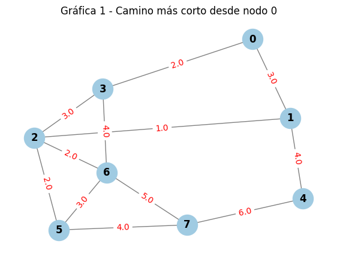
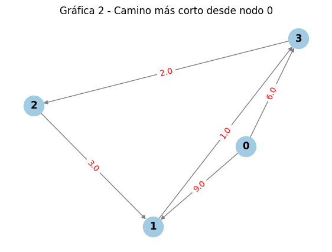
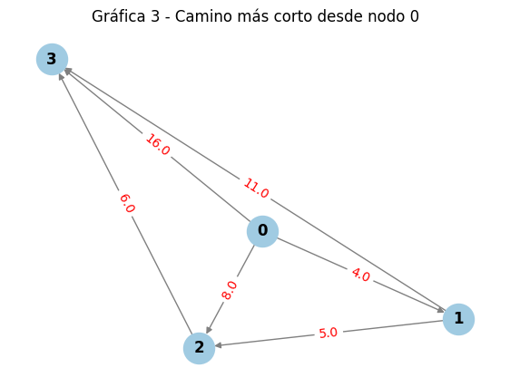
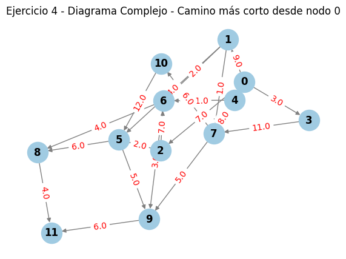

# Práctica 6

## Integrantes

-  Hernández Coutiño José de Jesús
-  Góngora Ramírez Arturo 

## Uso e instalación

Aquí escribe qué necesitas que instale para ejecutar tu código:

- `matplotlib`
- `numpy`
- `math`
- `networkx`
- `csv`

Todo lo necesario para ejecutar el código se encuentra en:

- `main.py`: Contiene el código para graficar cada uno de los cuatro ejercicios

## Ejercicio 1
El objetivo era programar el algoritmo y probarlo con una matriz de 4x4, iniciando desde el nodo 0. Los vectores resultantes que devuelve tu código son:

Vector de Distancias (D): [0, 9, 8, 6]

Vector de Predecesores (P): [-1, 0, 3, 0]

Esto significa que, desde el nodo 0, el costo para llegar al nodo 1 es 9, al nodo 2 es 8 y al nodo 3 es 6.

## Ejercicio 2
Se pedía usar las listas del ejercicio anterior para encontrar el camino óptimo entre dos vértices. Si usamos el origen 0 y el destino 2 como ejemplo, la ruta que se forma rastreando hacia atrás el vector de predecesores es:Distancia total: 8Camino óptimo: Nodo 0 $\rightarrow$ Nodo 3 $\rightarrow$ Nodo 2

## Ejercicio 3
Aquí aplicamos las funciones a tres gráficas distintas, partiendo siempre del nodo 0. Donde había un 0, significaba que no existía arista.

Gráfica 1 (No dirigida, 8 nodos) Nodo 1: Distancia 3 (Ruta: 0 $\rightarrow$ 1)Nodo 2: Distancia 4 (Ruta: 0 $\rightarrow$ 1 $\rightarrow$ 2)Nodo 3: Distancia 2 (Ruta: 0 $\rightarrow$ 3)Nodo 4: Distancia 7 (Ruta: 0 $\rightarrow$ 1 $\rightarrow$ 4)Nodo 5: Distancia 6 (Ruta: 0 $\rightarrow$ 1 $\rightarrow$ 2 $\rightarrow$ 5)Nodo 6: Distancia 6 (Ruta: 0 $\rightarrow$ 3 $\rightarrow$ 6)Nodo 7: Distancia 10 (Ruta: 0 $\rightarrow$ 1 $\rightarrow$ 2 $\rightarrow$ 5 $\rightarrow$ 7)

 

Gráfica 2 (Dirigida, 4 nodos) Nodo 1: Distancia 9 (Ruta: 0 $\rightarrow$ 1)Nodo 2: Distancia 8 (Ruta: 0 $\rightarrow$ 3 $\rightarrow$ 2)Nodo 3: Distancia 6 (Ruta: 0 $\rightarrow$ 3)

Gráfica 3 (Dirigida, 4 nodos) Nodo 1: Distancia 4 (Ruta: 0 $\rightarrow$ 1)Nodo 2: Distancia 8 (Ruta: 0 $\rightarrow$ 2)Nodo 3: Distancia 14 (Ruta: 0 $\rightarrow$ 2 $\rightarrow$ 3)

## Ejercicio 4

Para el diagrama complejo (usando las conexiones de tu archivo CSV y ajustando la numeración para que coincida con los nodos del 1 al 12 de tu imagen), calculando el camino desde el Nodo 1, obtenemos:Nodo 2: Distancia 9 (Ruta: 1 $\rightarrow$ 2)Nodo 3: Distancia 7 (Ruta: 1 $\rightarrow$ 3)Nodo 4: Distancia 3 (Ruta: 1 $\rightarrow$ 4)Nodo 5: Distancia 2 (Ruta: 1 $\rightarrow$ 5)Nodo 6: Distancia 9 (Ruta: 1 $\rightarrow$ 3 $\rightarrow$ 6)Nodo 7: Distancia 11 (Ruta: 1 $\rightarrow$ 2 $\rightarrow$ 7)Nodo 8: Distancia 10 (Ruta: 1 $\rightarrow$ 5 $\rightarrow$ 8)Nodo 9: Distancia 15 (Ruta: 1 $\rightarrow$ 3 $\rightarrow$ 6 $\rightarrow$ 9)Nodo 10: Distancia 14 (Ruta: 1 $\rightarrow$ 3 $\rightarrow$ 6 $\rightarrow$ 10)Nodo 11: Distancia 16 (Ruta: 1 $\rightarrow$ 5 $\rightarrow$ 8 $\rightarrow$ 11)Nodo 12: Distancia 19 (Ruta: 1 $\rightarrow$ 3 $\rightarrow$ 6 $\rightarrow$ 9 $\rightarrow$ 12)

## Conclusión

¿Te gustó la programación dinámica? 
El algoritmo de Dijkstra es un excelente ejemplo, su filosofía de subproblemas óptimos con la programación dinámica. Me parece curioso cómo una regla local, elegir siempre el nodo más cercano no visitado, garantiza un resultado global óptimo.
¿Sientes que te será útil? 
Definitivamente. Es la base de los sistemas de navegación GPS y del enrutamiento de paquetes en internet.
¿Se te hace una buena estrategia para la resolución de problemas?
Es una estrategia eficiente. La idea de mantener un registro de "nodos permanentes"  evita cálculos redundantes, lo que hace que el algoritmo sea eficiente incluso en gráficas complejas como la del Ejercicio 4, que cuenta con 12 nodos y múltiples conexiones dirigidas.
